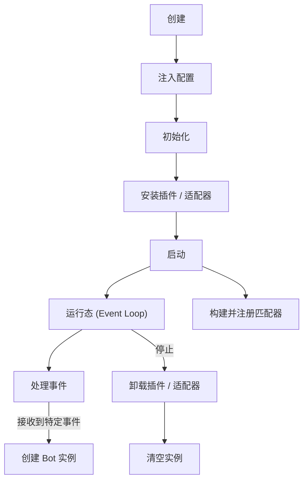
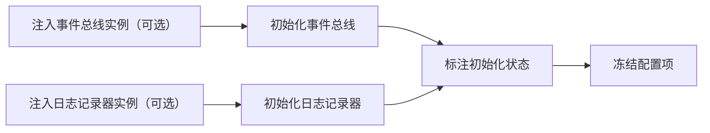
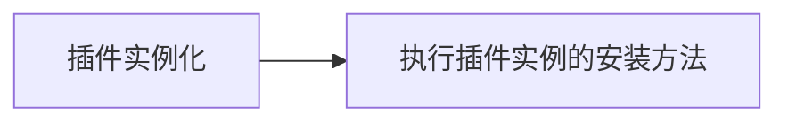
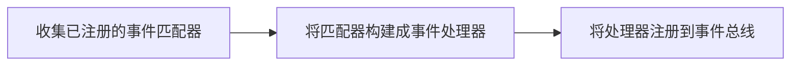

生命周期是一个 Sakiko 实例从被实例化到被释放的过程。

你可以参考下面这个流程图来了解 Sakiko 的生命周期。



## 创建

标准的 Sakiko 实例创建方式如下：

```typescript
import { Sakiko } from "@togawa-dev/sakiko";
const sakiko = new Sakiko();
```

绝大多数场景下只需要运行一个 Sakiko 实例即可实现需求，所以 `@togawa-dev/sakiko` 包中直接提供了一个全局单例，方便你省一行用来实例化的代码。

```typescript
import { sakiko } from "@togawa-dev/sakiko";
```

Sakiko 实例内的状态一般来讲是和外界无关的，所以你可以放心的在有必要的时候创建多个实例。

不过存在一种情况，在初始化流程中放入了外部的**事件总线**实例或者**日志记录器**实例，这种情况下多个 Sakiko 实例之间就可能会产生耦合（尤其是多个实例共用一个事件总线的情况），可能会引发一些意想不到的问题，如果你想这么做，请务必确保**_你了解自己在做什么_**。

## 注入配置

Sakiko 拥有简单的配置管理能力，允许你在初始化之前传入框架自身、插件以及适配器的配置项，并在后续流程中供它们读取，避免总是需要单独配置每个插件 / 适配器实例。

```typescript
sakiko.withConfig({
  logLevel: 2,
});
```

`.withConfig()` 方法可以调用多次，也可以一次性传入多个配置项对象，Sakiko 会自动组合它们，同名的配置项会被后传入的覆盖。

[配置项](/docs/config) 一节中对配置的使用和管理有更详细的介绍。

## 初始化



虽然叫做初始化，但是其实没做什么复杂的事情。

```typescript
sakiko.init();
```

`init()` 方法可以携带可选的初始化配置对象，比如：

```typescript
sakiko.init({
  noAsciiArt: true, // 禁用启动时的 ASCII 字符画
});
```

还可以用来注入自定义的日志记录器实例或者事件总线实例，详见[配置项](/docs/config)一节。

初始化阶段是用于区分配置注入阶段和插件 / 适配器安装阶段的一个分界线，在调用 `init()` 方法之后，Sakiko 实例中的配置项将被冻结，无法再被修改，以保证插件 / 适配器安装阶段读取到的配置项不会被后续的操作所影响。

## 安装插件 / 适配器



插件和适配器都可以通过 Sakiko 的 `install()` 方法来安装：

```typescript
import { OnebotV11Adapter } from "@togawa-dev/sakiko-adapter-onebot-v11";

// 直接使用从 Sakiko 中传入的配置项来初始化适配器实例
await sakiko.install(new OnebotV11Adapter());

// 或者先通过别的方式初始化适配器实例，再传入 Sakiko 实例中存储的配置项
const adapter = new OnebotV11Adapter({
  host: "0.0.0.0",
  port: 8080,
  accessToken: "your_access_token",
});

await sakiko.install(adapter);
```

插件 / 适配器一般会提供一个全局单例，方便你直接使用：

```typescript
import { OB11Adapter } from "@togawa-dev/sakiko-adapter-onebot-v11";

await sakiko.install(OB11Adapter);
```

:::note
对于适配器 / 插件来讲，从 Sakiko 实例中读取的配置项仍然有最高的优先级，会直接覆盖掉这种方式传入的同名配置项。

至少大部分情况下是这样的，毕竟插件的实现方式各不相同，具体行为还请参考对应插件的文档说明。
:::

当插件实例被通过 `install()` 方法安装之后，Sakiko 会调用该实例的安装方法，并将 Sakiko 实例的引用作为参数传入。

[插件](/docs/plugin)也有自己的生命周期，一般会在安装方法中完成自己的初始化工作，比如注册事件匹配器、初始化各种连接等等。

除此之外，插件还可以注册[钩子函数](/docs/hooks)，以实现在 Sakiko 后续的生命周期执行自定义逻辑。

## 启动



Sakiko 拥有两个启动方法，分别是 `run()` 和 `runWithoutBlock()`。

在用脚本独立运行 Sakiko 实例时，一般使用 `run()` 方法：

```typescript
import { sakiko } from "@togawa-dev/sakiko";

sakiko.init();

await sakiko.run();
```

`run()` 方法会做这些事情：

- 监听 `SIGINT` 和 `SIGTERM` 信号，在接收到信号时调用 `dispose()` 方法释放 Sakiko 实例并在之后退出进程。
- 调用 `runWithoutBlock()` 方法触发启动流程。
- 用 `await new Promise(() => {});` 使当前事件循环保持 pending 状态，使当前进程一直运行直到被信号终止。

:::warning
一旦调用了 `run()` 方法，当前进程就会被 Sakiko 实例占用，除非接收到终止信号，否则不会退出。

这意味着在调用 `run()` 方法之后的任何代码都不会被执行。
:::

对于要在其他有自己的事件循环的项目中使用 Sakiko 实例的场景，可以使用 `runWithoutBlock()` 方法：

```typescript
import { sakiko } from "@togawa-dev/sakiko";

sakiko.init();
await sakiko.runWithoutBlock();
```

这个方法只会触发启动流程，而不会阻塞当前进程，也不会监听停止信号。

:::note
如果你在调用 `runWithoutBlock()` 方法之后没有保持事件循环的运行状态，当前进程可能会立即退出，导致实例无法正常工作。

记得要在程序关闭前调用 `dispose()` 方法来安全释放 Sakiko 实例。
:::

## 运行态 / 事件循环

<a class="heimu">Node 本身就是一个事件驱动的运行时环境，每一个进程启动时就有自己的事件循环，所以 Sakiko 并没有额外创建新的事件循环，不过好像别的语言的框架都差不多有这么个流程，就暂时这么占着名字吧。</a>

<br></br><br></br>

在启动时，插件的 `afterSakikoStart` 钩子会被调用，此时适配器类型的插件一般会开始监听外部事件源，并在接收到事件时将其派发到 Sakiko 实例的事件总线中。

在事件总线开始接受并分派处理事件后，Sakiko 实例就进入了运行态。

运行态中，Sakiko 会根据事件的**类型**，将其派发到对应的事件处理器中进行处理。

详细的事件处理流程见[Umiri / 事件处理](/docs/nothing)。

特殊的是，适配器除了转发/创建事件之外，还会在连接建立之后一个或多个 Bot 实例，作为聊天机器人和目标平台间交互的桥梁，在[机器人](/docs/bot)中有更详细的介绍。

## 释放

当 Sakiko 实例需要被关闭时，可以调用 `dispose()` 方法来安全释放实例：

```typescript
await sakiko.dispose();
```

`dispose()` 方法会做这些事情：

- 调用所有已安装插件的 `beforeSakikoStop` 钩子，用于关闭插件内部的连接等
- 调用所有已安装插件的卸载方法，允许它们释放自己的资源并注销已注册的事件匹配器
- 清除 Sakiko 实例中的所有状态

如果启动时是通过有阻塞的 `run()` 方法启动的，调用 `dispose()` 方法之后会在释放完成后**退出进程**。

如果启动时是通过 `runWithoutBlock()` 方法启动的，则不会退出进程，开发者可以将 sakiko 实例在这之后重新初始化并启动，或者将其置为 `null` 以确保解除引用。
